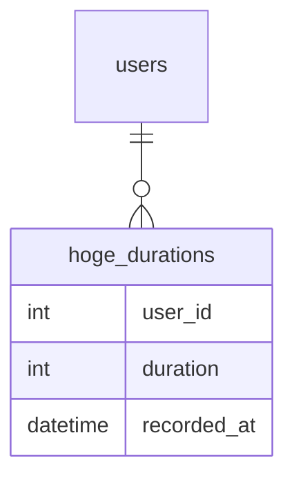

DBの負荷対策でSQLの結果の一部をキャッシュする対応を入れたことがありました。
その際に検討したことの紹介です。具体的な実装については書いていません。

# 前提
以下のような構成のアプリケーションで検討しました。
- Webやモバイルアプリをクライアントに持つRailsアプケーション
- DBはMySQL8.0
- キャッシュストアRedis

# 発生していた課題
- 一部の巨大なテーブル(10億~20億程度のレコード数)に対するSQLがDBに与える負荷が問題になっていた
- 特にcountやsumなどの集計関連のクエリがDBのCPU負荷上昇の問題となっていた

これらを解決する方法としてキャッシュの利用を進めました。

# 説明のための例
何らかの時間を記録するhoge_durationsというテーブルがあり、usersテーブルから見てhas_manyの関係にあるとします。

ユーザーが時間を記録するたびにレコードが増えていき、durationのsumの値も変わっていきます。

このsumのクエリの負荷が高く改善したいとします。
まずはindexのチューニングなどを行うべきですが、それをやり尽くしても限界がきたためキャッシュを使う方法を検討しました。

## 前提条件
hoge_durationsは新規追加だけではなく、過去のデータの更新や削除される可能性があるとします。
また、集計結果として古い情報は見せたくないため元データが更新された場合は古いキャッシュは破棄するか即座に更新する必要があるとします。

# 現状のワークロードを知る
まず一番大事なことはアプリケーションでの使われ方を知ることです。

以下のようなことを確認します。
- 書き込みが多いのか、読み込みの多いのか
- ユーザー毎に偏り
- 時間帯による偏り

write count > read count となっている場合、キャッシュしても効果が低い可能性が高いです。（実装にもよります）
また、一部のユーザーは書き込みが多いがほとんどのユーザーは読み込みが多いなどユーザー毎の偏りも重要になってきます。
例えば、X(Twitter)をイメージすると一部ユーザーは書き込みはあまりしておらず読み込みが多いことが想像できます

他にもreadやwriteがスパイクする時間があるかなども重要な要素になります。

DatadogなどのAPMで該当のクエリがどれぐらい呼ばれているか、データの更新がどれぐらいされるかなどを確認しました。

# キャッシュの作成方法の検討
初回のキャッシュの生成は以下のように複数の方式を組み合わせる方法としました。
- 読み込みでキャッシュが必要になったタイミングでRedisにキャッシュが存在するかチェックし、存在しない場合はMySQLから集計結果を取得してRedisに保存する([Cache-Aside (Lazy Loading)](https://docs.aws.amazon.com/whitepapers/latest/database-caching-strategies-using-redis/caching-patterns.html))
- durationをMySQLで保存した後にRedisにキャッシュが存在するかチェックし、存在しない場合はMySQLから集計結果を取得してRedisに保存する（[Write-Through](https://docs.aws.amazon.com/whitepapers/latest/database-caching-strategies-using-redis/caching-patterns.html)）

Write-Throughを採用する場合は使用されるかわからないキャッシュがRedisに保存されることになるためRedis側のメモリに問題ないか考慮する必要があります。
今回は問題ないと判断してキャッシュミスを減らすためにWrite-Throughを合わせて採用しました。

# 更新方法の検討
sumの結果をキャッシュする場合のキャッシュの更新方法について以下の二つの方法を検討しました
- キャッシュの値を元に再計算する方式
- MySQLのデータから再集計する方式

## キャッシュの値を元に再計算する方式
書き込みが発生する場合に、`キャッシュ済みの値を元に新しい値を計算`する方法です。

### レコードの追加
例えば、duration_sumとして20がキャッシュされている場合に新しいdurationが10として新規レコードがinsertされる場合、以下のような流れになります
1. 新しいduration(=10)のレコードをMySQLに保存
2. キャッシュされている値(=20)をRedisから取得
3. キャッシャの値にdurationの値を加算(20+10)して新しい値をRedisに保存

1と2は順番は逆でも問題はありません。
更新が同時に行われない場合はシンプルですが、同時に行われる場合はRedisを含めたトランザクション管理が必要となりかなり複雑な実装となってしまい、バグも発生しやすくなります。
また、キャッシュを元に次の値を計算していくため一度MySQLとずれてしまった場合にそれを元に戻す方法の検討が必要です。

### レコードの更新
過去のdurationを更新できる場合はそのことも考慮する必要があります。

例えば、duration_sumとして20がキャッシュされている場合にdurationが10として保存されたレコードのdurationを5に更新場合、以下のような流れが考えられます。
1. duration(=10)のレコードのdurationを5に更新してMySQLに保存（元のdurationの値はアプリケーション側で保持しておく）
2. キャッシュされている値(=20)をRedisから取得
3. 保持していた値(=10)と更新後の値(=5)の差分を計算(10-5)し、キャッシャの値にdurationの値を加算(20-5)して新しい値(=15)をRedisに保存

### レコードの削除
更新と同様の流れです。

例えば、duration_sumとして20がキャッシュされている場合にdurationが10として保存されたレコードを削除する場合、以下のような流れが考えられます。
1. duration(=10)のレコードをMySQLから削除（元のdurationの値はアプリケーション側で保持しておく）
2. キャッシュされている値(=20)をRedisから取得
3. キャッシャの値からdurationの値を減算(20-10)して新しい値(=10)をRedisに保存

### メリット/デメリット
#### メリット
- キャッシュを更新する際に再集計が不要なため初回を除いて負荷の高いクエリを実行する必要がない。そのためキャッシュを都度計算し直す方式よりもMySQLの負荷を軽減する効果が大きい

#### デメリット
- キャッシュの値がDBとずれないようにRedisを含めてトランザクション管理する仕組みや、ずれた時に元に戻す仕組みの検討が必要なため実装が複雑になりバグも発生しやすい

## MySQLのデータから再集計する方式
関連するデータに更新があった場合にキャッシュをクリアしてから`MySQLのデータを元に再集計`した値をキャッシュし直す方式です。

## レコードの追加、更新、削除
全て同じ流れですが、追加で考えます。

例えば、duration_sumとして20がキャッシュされている場合に新しいdurationが10として新規レコードがinsertされる場合、以下のような流れになります
1. 新しいduration(=10)のレコードをMySQLに保存
2. キャッシュをRedisから取得
3. MySQLから総時間を集計してしRedisに保存

更新、削除いつては1がそれぞれ更新、削除に変わるだけです。

### メリット/デメリット
#### メリット
- 実装がシンプルになる
- キャッシュの値がDBと不一致になったとしても、次の更新で元に戻る

#### デメリット
- キャッシュを加算する方式と比べるとMySQLの負荷を軽減する効果は小さい
  - Readヘビーな場合は効果が大きいが、Writeヘビーな場合は逆に負荷が上昇してしまう可能性もある

## 採用した方式
実装や運用のしやすさと次に書いた効果の見積もりと合わせて、MySQLのデータから再集計する方式を採用しました。

# 効果の見積もり
現状のワークロードとキャッシュの方式を合わせてどれぐらいの効果が見込めるかを見積ります。

例）キャッシュを都度計算し直す方式を採用した場合
1週間に1億回該当のクエリが呼ばれているとして、更新が1千万回あるとすると単純に計算すると集計のSQLは更新時に発行されるため、
`1億 - 1千万 = 9千万回`
の集計クエリの発行が削減できることが見込めます。

# その他の考慮
他にも以下のような検討をしました。

## MySQLの負荷を軽減する機能の理解
MySQL8.0以降では、クエリキャッシュの機能はなくなりましたが、バッファプールは残っています。
対象のデータがバッファプールにのっている場合はクエリの応答が速くなります。そのためRedisでキャッシュするようになっても想定しているほどレイテンシーの改善は見られない可能性があります。
しかし、バッファプールは全てのデータをのせるわけではないため利用頻度の低いデータなどでは改善が期待できます。
また、データベースへのクエリの発行回数という点では、キャッシュ利用により数を抑えることができるためDBへの負荷軽減は一定見込まれます。

## アプリケーション側の実装
以下のあたりを考慮しました
- キャッシュのための処理を集約する
  - キャッシュしているコードが散らばっているとどのデータをキャッシュしているか調査が難しくなるため、キャッシュ用のクラスを通して処理するようにする
- バグがあった場合にいつでもキャッシュしない状態に戻せるようにする
- キャッシュをクリアする方法を準備する

## 機能リリース後に確認するメトリクス
機能リリース後に想定した効果が見られるか、Redisのリソースなどに問題は見られないかなどを確認するために見るメトリクスを決めておきます。

# さいごに
DBの負荷対策でSQLの結果をRedisにキャッシュする対応を入れた際に検討したことを書きました。
キャッシュを使うと複雑性が増すため使いすぎは注意ですが、効果が期待でき運用面の複雑さやコストを抑えられる場合は利用するのもありではないでしょうか。
